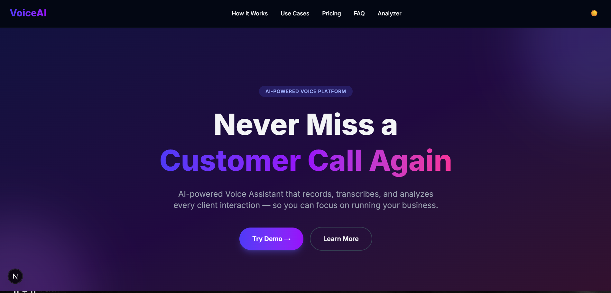
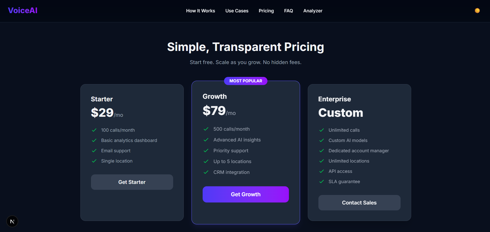
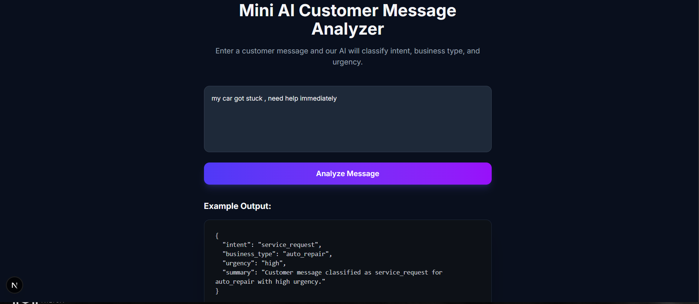

# VoiceAI - Full Stack Intern Assignment Submission

A full-stack Voice AI startup demo featuring a responsive marketing landing page and a mini AI-powered customer message analyzer.

## Demo Screenshots

### Hero Section


### Pricing Section


### Mini AI Customer Message Analyzer


## Assignment Requirements Checklist

### Part 1 - Landing Page
- [x] Hero section with headline, product description, and CTA
- [x] How It Works section with 4 workflow steps
- [x] Use Cases section with 3 required business types
  - [x] Auto Repair Shop
  - [x] Restaurant
  - [x] Medical/Dental Clinic
- [x] Pricing section with tiered cards
- [x] FAQ section (5 FAQs)
- [x] Footer with internal navigation, contact/demo, and resource links

### Part 2 - SEO & Linking
- [x] Proper page title and meta description
- [x] Open Graph tags and Twitter card metadata
- [x] Semantic HTML structure (`header`, `main`, `section`, `footer`)
- [x] Heading hierarchy with `h1`, `h2`, `h3`
- [x] `sitemap.xml`
- [x] `robots.txt`
- [x] Internal section links/navigation
- [x] At least 5 relevant external resource links

### Part 3 - Mini AI Customer Message Analyzer
- [x] Textarea input
- [x] Submit button
- [x] Loading state
- [x] Result display card
- [x] Backend API endpoint (`POST /analyze` and `POST /api/analyze`)

## Tech Stack

- Frontend: Next.js (App Router), TypeScript, Tailwind CSS
- Backend: Node.js, Express
- Optional/Bonus: Dark mode support, responsive design, polished UI

## Project Structure

- `frontend/next-app/` - Frontend application
- `backend/` - Express API backend
- `screenshots/` - README demo assets

## Local Setup

### 1. Run Backend
```bash
cd backend
npm install
node server.js
```
Backend runs at `http://localhost:5000`.

### 2. Run Frontend
```bash
cd frontend/next-app
npm install
npm run dev
```
Frontend runs at `http://localhost:3000`.

## API Contract

### POST `/analyze`
Request body:
```json
{
  "message": "My car won't start and I need help today."
}
```

Response body:
```json
{
  "intent": "service_request",
  "business_type": "auto_repair",
  "urgency": "high",
  "summary": "Customer needs urgent assistance for auto repair issue."
}
```

## Notes

This implementation intentionally keeps the architecture practical and assignment-focused while maintaining clean structure and production-style presentation.
